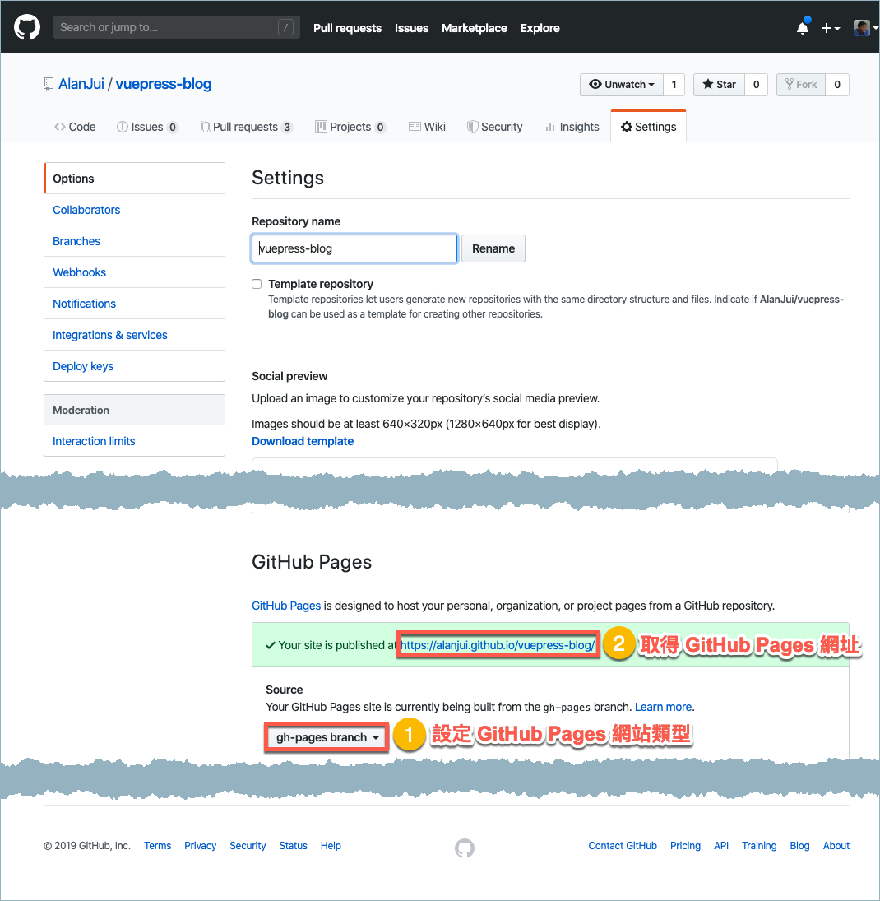

# 操作指引

::: warning 小心留意
《操作指引》文件尚未完成編撰，本處所見內容僅是示意用舉例，非本部落真正之操作指引。
:::

## 簡介

本操作指引用於導引使用者，知曉如何透過本 [VuePress 部落格模版](https://github.com/AlanJui/vuepress-blog)，創造個人專屬之部落格。對於模版未盡滿意處，請參考 [VuePress](https://vuepress.vuejs.org) 官網技術文件，自行擴展功能。

## 開始啟用

### 事前準備

- [NodeJS >= 8](https://nodejs.org/)
- [yarn](https://yarnpkg.com/lang/en/docs/install/) (可考慮選項)
- git
- 略通「終端機」之操作，知曉指令如何輸入及執行

### 安裝作業

決定好「工作目錄」所在路徑，然後啟動「終端機」軟體，透過 cd 指令進入工作目錄。

::: tip

「工作目錄」參考，例如： `~/workspace/vuepress/`

:::


1. 自 GitHub 下載本部落格模版至個人端之電腦。

    ```bash
    git clone https://github.com/AlanJui/vuepress-blog.git
    ```

2. 進入部落格模版所在目錄處。

    ```bash
    cd vuepress-blog
    ```

3. 安裝 Node.js 相關模組套件。

    ```bash
    npm install # or yarn
    ```

4. 啟動編輯操作模式。

    ```bash
    npm run dev # OR yarn dev
    ```

5. 打開 Web 瀏覽器，輸入「網址」： [http://localhost:8080](http://localhost:8080) ，若操作一切正常，將可看到如下所示之部落格「首頁」。

    


## 操作教學

### 文章編輯作業

1. 在子目錄路徑處：·`./docs/posts/` ，建立一個名為： `my-post.md` 之 Markdown 檔案。

    ::: tip
    檔案建立，可透過終端機下指令完成：
    
     `$ touch ./docs/posts/my-post.md`
    :::
    
    若是使用「檔案總管」瀏覽此工作目錄，各個「目錄」與「檔案」之結構關聯，將如下圖所示：
    
    ```{12}
    .
    ├── README.md
    ├── deploy.sh
    ├── docs
    │   ├── .vuepress
    │   ├── README.md
    │   ├── guide
    │   │   └── README.md
    │   └── posts
    │       ├── README.md
    │       ├── pipenv_Shell_Prompt.md
    │       ├── my-post.md 
    │       ├── 在_Ubuntu_18_04_使用_Vagrant_Box_for_Libvirt.md
    │       └── 在_macOS_Catlina_安裝_Vue_js.md
    ├── node_modules/
    │   ├── ```
    │   ├── ```
    │   └── ``` 
    ├── package-lock.json
    └── package.json
    ```
    
2. 啟動個人慣用之「文字編輯器」，並打開檔案： `my-post.md` ，準備開始進行文件之編輯作業。

3. 將以下範例複製並貼入 `my-post.md` 檔案之中：

    ```
    ---
    title: 我的首篇發文
    date: 2019-10-20 22:52:00
    description: 試用 VuePress 部落格模版，學習如何「發文」之操作程序⋯⋯
    sidebar: auto 
    ---
    
    # 大家好！
    
    我的部落格開張囉，這是我的首篇發文，請多指教嘿！
    
    ::: tip
    我的部落格好看嗎？告訴你，製作過程超簡單！
    :::
    
    > 「懷才就跟懷孕一樣，時間久了才能讓人看出來。」⋯⋯⋯語出：__《非典格言錄》__
    ```
    
4.  :confetti_ball: 完成「存檔」後，再次回到「瀏覽器」，然後依下列圖示操作，即可看到剛完成之發文。

    
    
    

### 文章發佈作業

以 GitHub Pages 為例，說明於個人端完成編輯之部落格文章，如何發佈到 GitHub 網站（此時之 GitHub 網站等同 HTTP 伺服器）。

參考 [GitHub Pages 指引](https://guides.github.com/features/pages/)，完成應有之設定，並取得 GitHub 網址（參考下述提示決定要用「個人專用型網址」，還是「專案專用型網址」）。

::: tip
- 個人專用型網址： https://《UserName》.github.io/

        【範例】： https://alanjui.github.io/


- 專案專用型網址： https://《UserName》.github.io/《Repo》/

        【範例】： https://alanjui.github.io/vuepress-blog/
:::




1. 依上述之說明，先取得部落格佈署處之 GitHub 網址，再透過「文字編器」填入 `deploy.sh` 檔案中。

    - 個人專用型網址：填入第 21 行
    - 專案專用型網址：填入第 25 行
    
    ```shell script{21,25}
    #!/usr/bin/env sh
    
    # abort on errors
    set -e
    
    # build
    npm run build
    
    # navigate into the build output directory
    cd docs/.vuepress/dist/
    
    # if you are deploying to a custom domain
    # echo 'www.example.com' > CNAME
    
    git init
    git add -A
    git commit -m 'deploy'
    
    # if you are deploying to https://<USERNAME>.github.io
    # git push -f git@github.com:<USERNAME>/<USERNAME>.github.io.git master
    # git push -f git@github.com:AlanJui/AlanJui.github.io.git master
    
    # if you are deploying to https://<USERNAME>.github.io/<REPO>
    # git push -f git@github.com:<USERNAME>/<REPO>.git master:gh-pages
    # git push -f git@github.com:AlanJui/vuepress-blog.git master:gh-pages
    
    cd ../../..
    ```

2. 進入專案之「根目錄」，執行以下指令，要求 VuePress 將原屬 Markdown 檔案格式之文章，轉換成「網頁」專用之 HTML 檔案格式。轉換完成的輸出檔案，置放於： `docs/.vuepress/dist/` 目錄中。緊接著便立即執行「往 GitHub 佈署」作業，此時，將依 deploy.sh 中的「設定」，自位於 `docs/.vuepress/dist/` 目錄中的檔案，往 GitHub 傳送，完成部落格之佈署工作。

    ```shell script
	$ . deploy.sh
    ```

    ::: tip
    在 deploy.sh 之前，需先輸入一個「英文句點」，再加一個「英文空白字元」。
    :::


## 學習資源

### VjuePress 簡易入門教學影片

[VuePress Tutorial - Learn how to use VuePress for a Documentation Site (Beginner)](https://www.youtube.com/watch?v=5Kqyhu_eIcw)

<iframe width="560" height="315" src="https://www.youtube.com/embed/5Kqyhu_eIcw" frameborder="0" allow="accelerometer; autoplay; encrypted-media; gyroscope; picture-in-picture" allowfullscreen></iframe>

### Vue.js 快速入門教學影片

[Vue JS Crash Course - 2019](https://www.youtube.com/watch?v=Wy9q22isx3U)

<iframe width="560" height="315" src="https://www.youtube.com/embed/Wy9q22isx3U" frameborder="0" allow="accelerometer; autoplay; encrypted-media; gyroscope; picture-in-picture" allowfullscreen></iframe>

